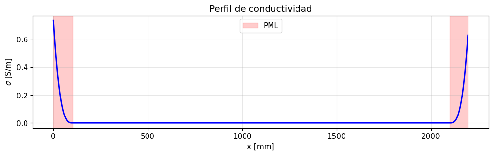
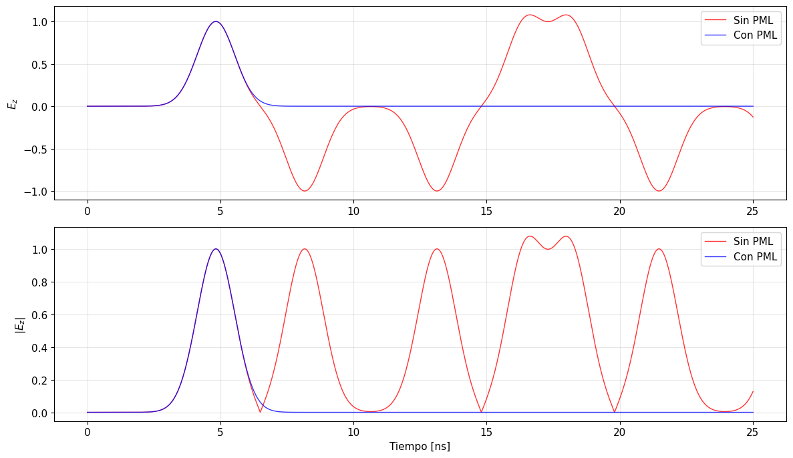
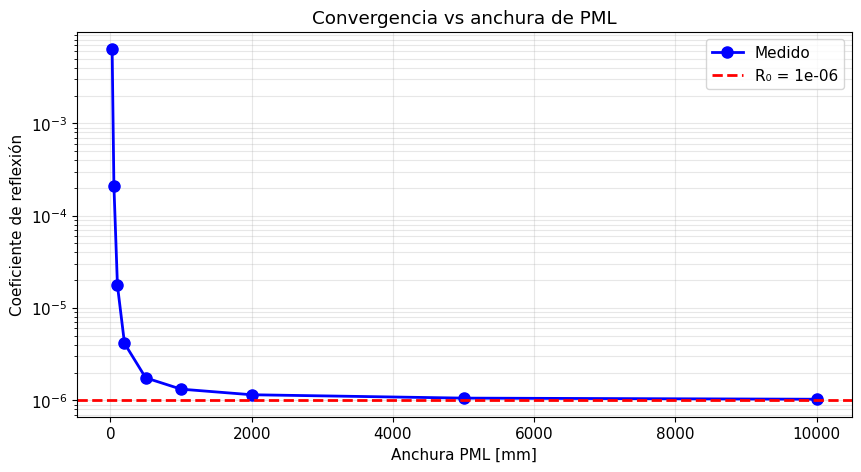
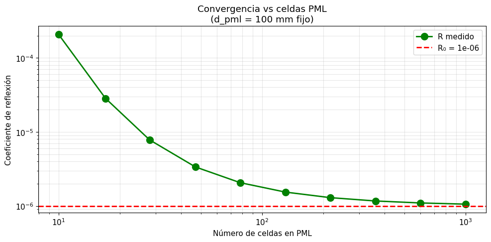
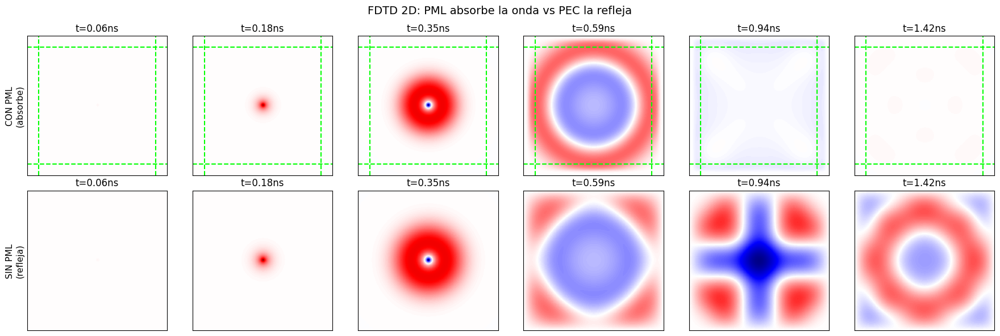
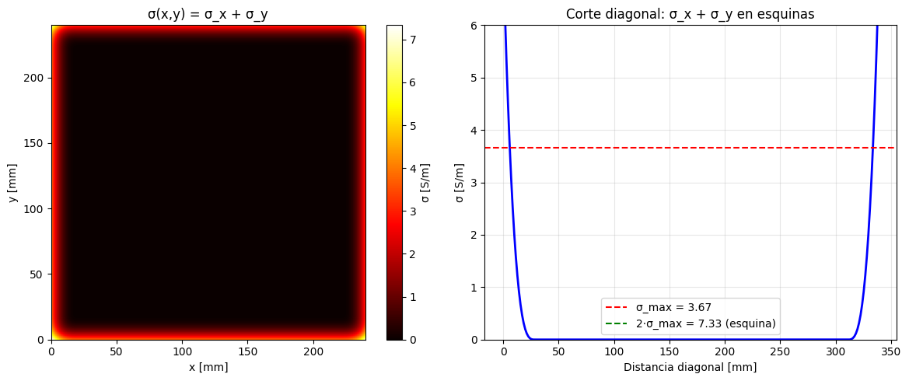

# FDTD-PML-Absorbing-Boundary-Conditions

FDTD solvers for the 1D and 2D electromagnetic wave equations with **Perfectly Matched Layer (PML)** absorbing boundary conditions. Implements the polynomial conductivity profile (Gedney, 1996) with correct staggered-grid discretisation and full treatment of 2D corner regions. Validates the measured reflection coefficient against the theoretical target $R_0$ as a function of PML width and spatial resolution. Numba JIT-compiled convergence sweeps included.

## Repository structure

```
FDTD-PML-Absorbing-Boundary-Conditions/
├── notebooks/
│   ├── PML_FDTD_1D.ipynb          # 1D solver and convergence study (Spanish)
│   ├── PML_FDTD_1D_EN.ipynb       # English translation
│   ├── PML_FDTD_2D.ipynb          # 2D solver with corner treatment (Spanish)
│   └── PML_FDTD_2D_EN.ipynb       # English translation
├── src/
│   ├── fdtd1d.py                  # FDTD1D class + transfer-matrix utilities
│   └── fdtd2d.py                  # FDTD2D class (TM mode)
├── tests/
│   ├── conftest.py
│   ├── test_fdtd1d.py
│   ├── test_pml.py
│   └── test_pml2d.py
├── figures/
│   ├── pml1d_sigma_profile.png
│   ├── pml1d_time_domain.png
│   ├── pml1d_pml_vs_pec.png
│   ├── pml1d_reflection_vs_width.png
│   ├── pml1d_reflection_vs_ncells.png
│   ├── pml2d_field_comparison.png
│   └── pml2d_sigma_profile.png
├── .gitattributes
├── .gitignore
└── README.md
```

---

## Physical model

### 1D Maxwell equations in the PML framework

The governing equations for the 1D TM mode (normalised units, $c = 1$):

$$\frac{\partial E_z}{\partial t} = -\frac{1}{\varepsilon_0}\frac{\partial H_y}{\partial x} - \frac{\sigma}{\varepsilon_0} E_z, \qquad \frac{\partial H_y}{\partial t} = -\frac{1}{\mu_0}\frac{\partial E_z}{\partial x} - \frac{\sigma^*}{\mu_0} H_y$$

Inside the PML the electric and magnetic conductivities satisfy $\sigma^* = \sigma \mu_0/\varepsilon_0$ (impedance-matching condition), which makes the PML reflectionless at any frequency and angle of incidence.

### Polynomial conductivity profile

The conductivity grows from zero at the PML interface to $\sigma_{\max}$ at the outer boundary following a polynomial ramp of order $m$:

$$\sigma(\xi) = \sigma_{\max}\left(\frac{\xi}{d}\right)^m, \qquad \sigma_{\max} = \frac{(m+1)\ln(1/R_0)}{2\eta_0\, d}$$

where $\xi$ is the distance from the interface, $d$ is the PML physical thickness, $\eta_0 = \sqrt{\mu_0/\varepsilon_0}$ is the free-space impedance, and $R_0$ is the theoretical reflection coefficient at normal incidence for a wave that traverses the PML twice.

### Yee staggered-grid discretisation (1D)

The leapfrog update equations with PML coefficients are:

$$H_y^{n+\frac{1}{2}}\!\left[i+\tfrac{1}{2}\right] = C_H \cdot H_y^{n-\frac{1}{2}}\!\left[i+\tfrac{1}{2}\right] - \frac{\Delta t}{\mu_0\,\Delta x}\frac{1}{1+f_H}\left(E_z^n[i+1] - E_z^n[i]\right)$$

$$E_z^{n+1}[i] = C_E \cdot E_z^n[i] + \frac{\Delta t}{\varepsilon_0\,\Delta x}\frac{1}{1+f_E}\left(H_y^{n+\frac{1}{2}}\!\left[i+\tfrac{1}{2}\right] - H_y^{n+\frac{1}{2}}\!\left[i-\tfrac{1}{2}\right]\right)$$

where $C_E = (1-f_E)/(1+f_E)$, $f_E = \sigma_E\Delta t/(2\varepsilon_0)$ and analogously for $C_H$.

Crucially, $\sigma_E$ is sampled at integer grid points $i\,\Delta x$ while $\sigma_H$ is sampled at half-integer points $(i+\tfrac{1}{2})\Delta x$ — using the same value for both would introduce a first-order staggering error that dominates the numerical reflection.

#### Conductivity profile and field at observation point — 1D



*Left: polynomial $\sigma(x)$ profile — zero in the physical domain, increasing into the PML. Right: $E_z$ at the observation point; the initial pulse arrives at ≈ 5 ns, any PML reflection would appear later at ≈ 19 ns.*

#### PML vs hard-wall (PEC) boundary — 1D



*Comparison of the field time series at the observation point with PML (blue) and without (red, PEC walls). With PML the field decays to the noise floor after the initial pulse; without PML the wave bounces back and forth indefinitely.*

---

### 1D convergence: reflection vs PML parameters

#### Reflection vs PML width



*Measured reflection coefficient as a function of PML physical width (fixed $\Delta x = 5\,\text{mm}$). Narrow PMLs are poorly resolved and the numerical reflection far exceeds $R_0 = 10^{-6}$ (dashed). Beyond ~200 mm the curve converges to $R_0$.*

#### Reflection vs spatial resolution (fixed width)



*Reflection coefficient vs number of PML cells (fixed $d = 100\,\text{mm}$). As $\Delta x \to 0$ the PML contains more cells and the discretisation error decreases, driving $R \to R_0$. Log–log slope confirms the expected polynomial convergence rate.*

---

### 2D TM mode — corner treatment

In 2D the computational domain decomposes into 9 regions. The key insight is that the corner regions require **both** conductivity components:

$$\sigma^{\text{corner}} = \sigma_x + \sigma_y$$

Each field component is assigned the conductivity component that corresponds to its spatial derivative direction:

| Field | Staggered position | Effective conductivity |
|---|---|---|
| $E_z[i,j]$ | $(i\Delta x,\, j\Delta y)$ | $\sigma_x + \sigma_y$ |
| $H_x[i,j]$ | $(i\Delta x,\, (j+\tfrac{1}{2})\Delta y)$ | $\sigma_y$ only |
| $H_y[i,j]$ | $((i+\tfrac{1}{2})\Delta x,\, j\Delta y)$ | $\sigma_x$ only |

The 2D Courant stability condition is:

$$\Delta t \leq \frac{1}{c\,\sqrt{1/\Delta x^2 + 1/\Delta y^2}}$$

#### 2D field evolution: PML vs PEC



*Six time snapshots (columns) for a Gaussian pulse launched from the centre of a 20 cm × 20 cm domain. Top row: with PML (green dashed lines mark the PML–domain interface) — the wave exits cleanly. Bottom row: without PML (PEC walls) — reflected waves create standing-wave interference patterns that persist indefinitely.*

#### 2D conductivity distribution



*Left: 2D map of $\sigma(x,y) = \sigma_x + \sigma_y$ — symmetric PML frames with enhanced corners. Right: diagonal cross-section confirming that $\sigma$ reaches $2\sigma_{\max}$ in the corners.*

---

## Running the tests

```bash
pip install numpy scipy numba pytest
pytest tests/ -v
```

The test suite checks:
- PML absorbs left- and right-travelling waves below a 5 % threshold
- One-sided PML (left PML + PEC right wall)
- 2D PML absorbs a Gaussian pulse from all directions
- $\sigma = 0$ inside the physical domain
- Corners have combined $\sigma > $ individual side values

---

## Author

**A. S. Amari Rabah** and **B. Gómez Peinado**

Developed as part of the coursework for *Computational Methods in Non-Linear Physics* — Master's Degree in Physics and Mathematics - Fisymat, University of Granada, Spain.
